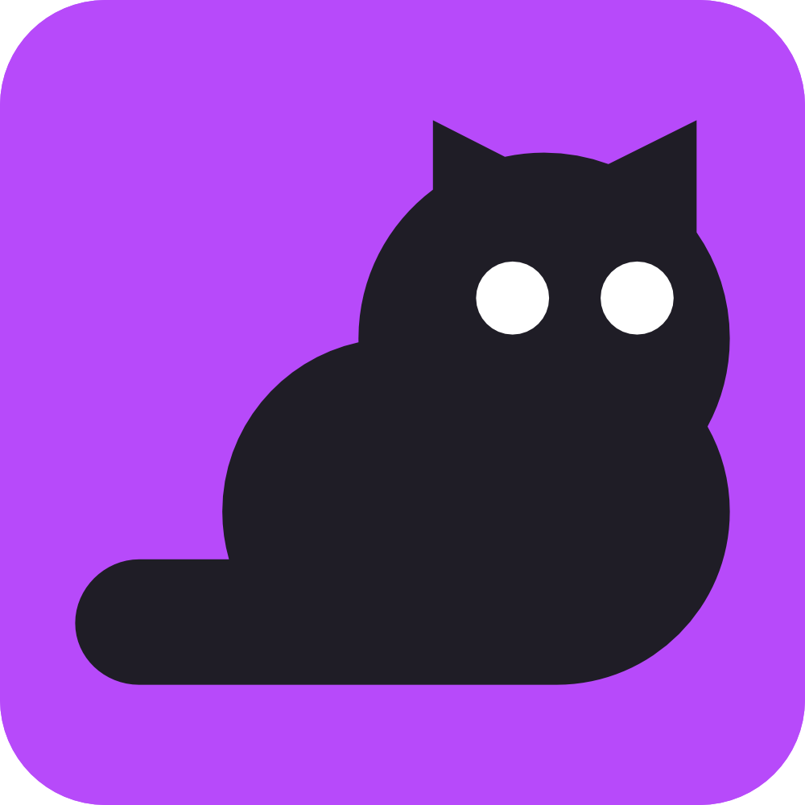

<a href="https://github.com/magnet2021/catbox">
  
</a>

# Catbox

[](https://img.shields.io/david/magnet2021/catbox.svg?style=flat)
[](https://img.shields.io/github/languages/code-size/magnet2021/catbox)
[](https://github.com/magnet2021/catbox)
[](https://img.shields.io/github/license/magnet2021/catbox?style=flat-square)

## Getting Started

### Installation

```bash
git clone https://github.com/magnet2021/catbox.git
cd catbox
```

Note: You will need at least NodeJS 10.18.1+, VSCode 1.44+, Yarn 1.17.3+ and MongoDB 3+. You will also need to configure .env variables before launching.

### Configuring Environment Variables

```bash
# Environment Config
# Store your secrets and config variables in here
# reference these in code with process.env.ENV_VARIABLE

PORT=3000
DB_URL=mongodb://mongodb.example.com:27017

# Note: MongoDB URI must be in the mongodb:// protocol, the mongodb+srv:// protocol is not supported
```

Create a file named `.env` to be able to interact with `process.env` in NodeJS.

### Usage

Catbox follows the latest maintenance LTS version of Node.

```bash
yarn
yarn start:dev
# build: yarn build
# production: yarn start
```

Visit [localhost:3000](http://localhost:3000) to view the application.

＼＿ﾍ(◕‿◕ ✰)
